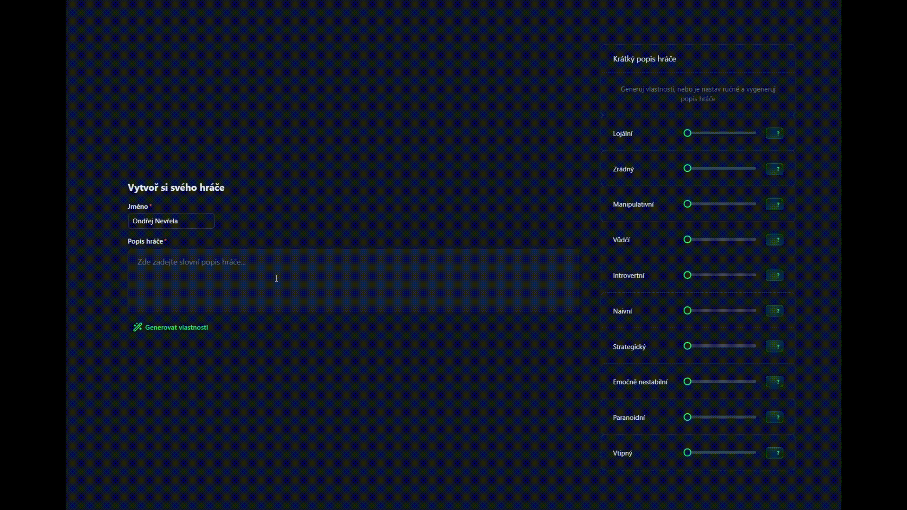

# 🎮 AI Survivor Simulation

AI Survivor je experimentální textově-grafická hra inspirovaná konceptem Survivor, kde hráč interaguje s AI řízenými postavami. AI simuluje vztahy, důvěru, lži, chování a rozhodování v reálném čase i ve fázích hry. Hra je navržena jako sandboxová simulace s důrazem na auditovatelnost a laditelnost AI výstupů.

Ukázka první verze generování hráčových vlastností pomocí textového popisu skrze LLM.

## ✨ Cíle projektu

- Vytvořit interaktivní hru s AI postavami, které mají paměť, osobnost a vlastní vnímání reality.
- Umožnit hráči reagovat textově nebo výběrem akcí.
- Využít pokročilé AI modely pro simulaci rozhovorů, vztahů a událostí.
- Umožnit debugování a rozvoj hry i bez aktivní AI (např. ručními zásahy).

---

## 🧱 Architektura

### Frontend (Nuxt 3 + Nuxt UI)

- Tvorba postavy (textově nebo výběr archetypu)
- Vizualizace vztahů (reálné vs. vnímané)
- Realtime rozhovory (chat režim)
- Výběr akcí ve fázích dne (text + makra)
- Timeline denního vývoje (AI výstupy)
- Kmenová rada, soutěže a odměny (plánováno)
- Debug/Admin UI (logy, snapshoty, prompty)

### Backend (API Platform, PostgreSQL, PHP 8.4)

- Orchestrace fází hry (tick systém – 2h bloky)
- Ukládání snapshotů stavu (JSONB)
- Audit AI logů (prompt, odpověď, seed, tagy)
- Práce s prompty (verzování, tagování, validace)
- Entitní model: hráči, NPC, vztahy, paměť, logy, milníky
- Možnost ručního režimu bez AI

### AI Gateway (OpenAI, Ollama, Claude…)

- Prompt builder s verzováním
- Rozlišení systémových promptů / instrukcí
- Validace výstupů (např. JSON schema)
- Wrapper pro synchronní volání (plánovaný worker/fronta)
- Logging včetně metadat a seed hodnot

---

## 🧠 AI Strategie

### Tick systém:

1. Hráč zadá akci
2. Backend uloží akci a spustí AI simulaci
3. Frontend čeká na výstup (`polling` nebo `websocket`)
4. Výstup je filtrovaný z pohledu hráče

### AI režimy:

- `tick_output` – události za daný blok
- `dialogue` – realtime rozhovor
- `reflection` – zhodnocení vztahů, nálad
- `trait_inference` – převod popisu hráče na strukturu
- `npc_generation` – tvorba NPC z traitů
- `snapshot_restore` – obnova stavu hry

### Principy:

- Prompt verzování a tagování
- Filtrace výstupu dle perspektivy hráče
- Seedování pro reprodukovatelnost
- Validace výstupů (délka, struktura, konzistence)

---

## 🧠 Model postav

Každá postava má:

- `real_state`: objektivní vztahy (např. skutečná důvěra)
- `memory_state`: vnímané vztahy (iluze, klam)
- `traits`: osobnostní rysy
- `public_behavior`: log chování navenek

**Příklad:**  
Tomáš → Anna:  
`real_state.trust = 0.1`  
`memory_state.trust = 0.8`  
→ Navenek se chová jako přítel, ale je připraven ji zradit.

---

## 🗃️ Návrh databáze

### Klíčové entity (PostgreSQL):

- `game`: fáze, verze pravidel, sandbox mód
- `player`: jméno, avatar, popis, řízení hráčem
- `traits_def` / `player_traits`: definice a síla traitů
- `real_state` / `memory_state`: vztahy
- `milestone`: události a změny
- `conversation`: záznamy rozhovorů (JSONB)
- `game_log`, `game_snapshot`: logy a stavy
- `ai_log`: vstupy, výstupy, seed
- `prompt_template`: volitelný editor promptů v adminu

---

## ✅ Vývojové poznámky

- Hráč zatím nemůže vypadnout (pozorovatel režim později)
- Vše laděno v sandbox režimu
- UI i DB nástroje pro debugging
- AI výstupy jsou selektivní dle perspektivy hráče
- Prompt builder a systémový prompt jsou verzovatelné
- Tick systém je asynchronní (UI ↔ Backend ↔ AI)

---

## ❓ Otázky k rozpracování

- Bude každý typ promptu mít vlastní builder?
- Má být správa promptů dostupná i z UI?
- Budou se pravidla hry měnit i v běhu?
- Jak navrhnout rychlý simulační mód bez UI?
- Kde přesně začíná/končí perspektiva hráče?
- Jak AI výstupy rozliší „falešnou“ vs. „reálnou“ důvěru?

---

## 🔧 Stav projektu

Projekt je ve fázi návrhu a počáteční implementace. Architektura je modulární, AI je integrována jako klíčová vrstva herní logiky. Výstupy jsou plně auditované a laditelné.

- Hotové je generování hráče a jeho vlastností na základě textového popisu, popřípadě generování popisu hráče na základě nastavení vlastností.
- První verze administrace, zatím bez ACL

---

## 👤 Autor

**Ondřej Nevřela**  
[🌐 ondrejnevrela.cz](https://ondrejnevrela.cz/)  
[💼 LinkedIn](https://www.linkedin.com/in/ondrej-nevrela/)

---

