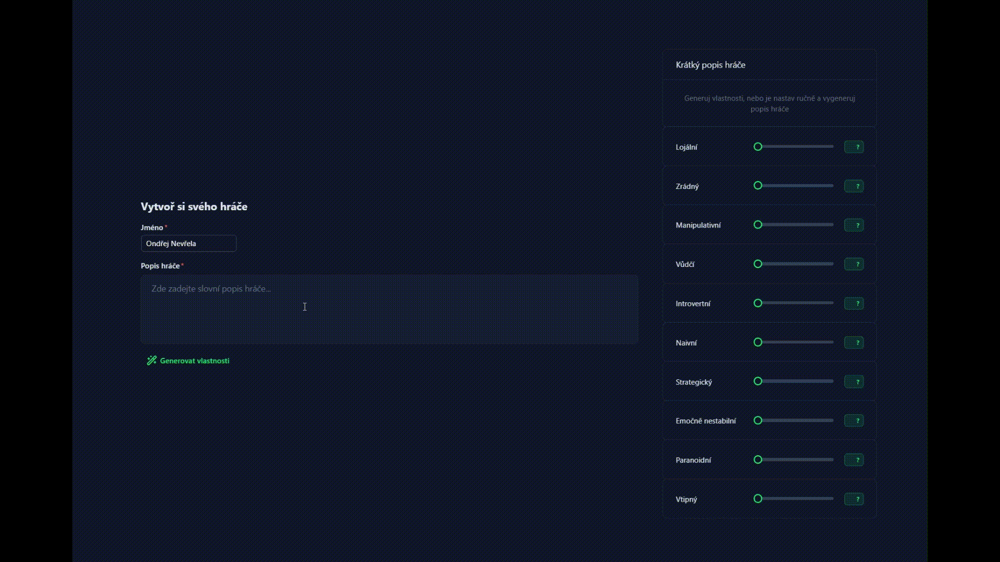

# AI Survivor Simulation

AI Survivor je experimentalni textova hra inspirovana konceptem Survivor, kde hrac interaguje s AI rizenymi postavami. Jeden lidsky hrac soutezi po boku 5 AI postav na virtualnim ostrove. AI simuluje osobnosti, vztahy, duveru, manipulace a rozhodovani v tick-based systemu (kazdy tick = 2 hernihodiny). Hra je navrzena jako plne auditovatelna sandbox simulace.

## Ukazka

Ukazka generovani vlastnosti na zaklade textoveho popisu hrace.


## Cile projektu

- Interaktivni hra s AI postavami, ktere maji pamet, osobnost a vlastni vnimani reality
- Hrac reaguje textove — zadava akce kazdy tick, AI simuluje co se deje na ostrove
- Google Gemini API pro simulaci udalosti, vztahu a narativu
- Plna auditovatelnost AI vystupu (prompty, odpovedi, tokeny, trvani)

---

## Architektura

### Backend (Symfony 8.0, PHP 8.5+, PostgreSQL 18.1)

- Domain-Driven Design — kod organizovany do domen (`Ai`, `Game`, `Player`, `Relationship`, `TraitDef`, `User`)
- Striktni Controller -> Facade -> Service vzor
- Tick system — orchestrace hernich fazi po 2hodinovych blocich
- AI operace jako typovane objekty s Result VO
- Kompletni audit AI volani (AiLog entita)
- JWT autentizace (LexikJWTAuthenticationBundle)
- PHPCS + PHPStan (level max) + PHPUnit 12

### Frontend (Nuxt 3 + Nuxt UI 3)

- SSR disabled, Pinia stores, VueUse
- Zakladni admin rozhrani (traity, uzivatele)
- Konfigurator hrace (rozpracovano)
- Pozn.: frontend je zakladni a bude refaktorovan

### AI (Google Gemini API)

- Vlastni `GeminiClient` — prime REST volani Gemini API
- `AiOrchestrator` — propojuje prompt loading, request building, logovani a parsovani
- `PromptLoader` — nacitani `.md` sablon s variable substitution
- Typovane `AiOperation<T>` pro kazdy use-case
- Prompt injection ochrana (akce hrace v sandboxovanych delimiterech)

### Infrastruktura (Docker Compose)

| Sluzba | Port | Popis |
|--------|------|-------|
| PHP-FPM | — | Backend runtime |
| Nginx | 8000 | API reverse proxy |
| PostgreSQL 18.1 | 5432 | Databaze (`survivor`) |
| Adminer | 8080 | DB prohlizec |
| pgAdmin | 5050 | Plny DB admin |

---

## Tick system (herniloop)

1. Hrac zada textovou akci (`POST /api/game/{id}/tick`)
2. Backend ulozi akci jako `PlayerAction` event
3. Nacte hrace, vztahy, posledni 3 ticky udalosti, az 5 major events per hrac (pamet)
4. Sestavi kontext vcetne backstage dynamik (high/low trust pary, trait agendas)
5. Zavola Gemini API pres `SimulateTickOperation`
6. AI vrati: reasoning, lokace hracu, makro narativ (3. osoba), hracuv narativ (2. osoba), zmeny vztahu, major events
7. `SimulationService` aplikuje vysledky — vytvori eventy, upravi skore vztahu, extrahuje major events
8. `GameService` posune hodiny (+2h); pri 24h vytvori NightSleep event a prejde na dalsi den

---

## AI operace

| Operace | Popis |
|---------|-------|
| `GeneratePlayerTraitsOperation` | Inference traitovych skore (0.0–1.0) z textoveho popisu |
| `GenerateBatchPlayerSummariesOperation` | Generovani osobnostnich popisu pro vice AI hracu najednou |
| `InitializeRelationshipsOperation` | Asymetricke prvni-dojem vztahy pro vsechny pary hracu |
| `SimulateTickOperation` | Jadro simulace — narativ, zmeny vztahu, major events za 2h blok |

---

## Databazove schema

| Tabulka | Popis |
|---------|-------|
| `app_user` | Uzivatele (email, role, heslo) |
| `trait_def` | Katalog osobnostnich rysu (10 seeded: loyal, treacherous, manipulative, ...) |
| `game` | Herni session (status, currentDay/Hour/Tick, owner) |
| `player` | Hraci (jmeno, popis, game FK; user FK nullable = AI kdyz null) |
| `player_trait` | Prirazene traity se silou (NUMERIC 3,2) |
| `relationship` | Asymetricke vztahy (trust/affinity/respect/threat 0–100) |
| `game_event` | Log udalosti (typ, den/hodina/tick, narativ, metadata JSON) |
| `major_event` | Zapamatahodne momenty (typ, souhrn, emocni vaha 1–10) |
| `major_event_participant` | Hraci v major events (role: initiator/target/witness) |
| `ai_log` | Audit AI volani (model, prompty, request/response JSON, tokeny, trvani, status) |

---

## API endpointy

| Metoda | Cesta | Popis |
|--------|-------|-------|
| POST | `/api/register` | Registrace uzivatele |
| POST | `/api/login_check` | JWT prihlaseni |
| GET | `/api/user/me` | Info o aktualnim uzivateli |
| GET | `/api/trait-def/` | Seznam vsech trait definic |
| POST | `/api/game/player/traits/generate` | AI: inference traitu z textoveho popisu |
| POST | `/api/game/player/traits/generate-summary-description` | AI: generovani popisu z trait mapy |
| POST | `/api/game/create` | Vytvoreni hry (spusti batch AI summary + init vztahu) |
| POST | `/api/game/{id}/start` | Start hry (status -> in_progress, den 1, hodina 6) |
| POST | `/api/game/{id}/tick` | Zpracovani ticku (AI simulace, aplikace vysledku, posun hodin) |
| POST | `/api/game/{id}/tick/preview` | Dry-run preview (AI bezi, ale stav se nemeni) |
| GET | `/api/game/{id}/events` | Strankovany log udalosti |

---

## Testovani

54 testu ve 3 vrstvach:

- **Unit (38)** — cista logika bez DB a mocku (Service, Entity, VO, Operation testy)
- **Integration (5)** — KernelTestCase + DAMA rollback (Facade testy s realnou DB)
- **Functional (5)** — WebTestCase + HTTP testy (Controller testy)

```bash
docker-compose exec php composer test              # Vsechny testy
docker-compose exec php composer test:unit          # Jen unit
docker-compose exec php composer test:integration   # Jen integracni
docker-compose exec php composer test:functional    # Jen funkcionalni
docker-compose exec php composer qa                 # PHPCS + PHPStan + vsechny testy
```

---

## Spusteni

```bash
# Infrastruktura
docker-compose up -d

# Backend (z backend/)
composer install
php bin/console doctrine:migrations:migrate
php bin/console app:sample-data:create    # Seed traitu a uzivatelu (admin@admin.cz / admin123)

# Frontend (z frontend/)
npm install
npm run dev                               # Dev server na localhost:3000
```

---

## Stav projektu

### Hotovo

- Kompletni herni lifecycle: vytvoreni -> start -> tick loop -> event log
- 6 hracu (1 lidsky + 5 AI: Alex, Bara, Cyril, Dana, Emil)
- AI generovani traitovych skore z textoveho popisu
- AI generovani osobnostnich popisu (batch)
- AI inicializace asymetrickych vztahu (trust/affinity/respect/threat)
- Per-tick AI simulace: reasoning, lokace, dualninarativ (makro + hracova perspektiva), zmeny vztahu, major events
- Pamet hracu — az 5 poslednich major events injectovanych do kontextu kazdeho ticku
- Backstage kontext — high/low trust pary, trait-driven AI agendy
- Prompt injection ochrana (akce hrace v sandboxovanych delimiterech)
- Dry-run preview endpoint (AI bezi bez mutace stavu)
- Den/noc cyklus (ticky po 2h; pri 24h NightSleep event a prechod na dalsi den)
- Kompletni audit AI volani (tokeny, trvani, status, raw JSON)
- Administrace traitu a uzivatelu
- JWT autentizace
- PHPCS + PHPStan (level max) + 54 testu

### Planovano

- Eliminacni mechaniky a hlasovani
- Kmenova rada (tribal council)
- Souteze a odmeny (challenge/reward)
- Realtime UI pro herni loop
- Vizualizace vztahu ve frontendu
- Rozhovory v realnem case (dialogue mod)

---

## Autor

**Ondrej Nevrela**
[ondrejnevrela.cz](https://ondrejnevrela.cz/)
[LinkedIn](https://www.linkedin.com/in/ondrej-nevrela/)
